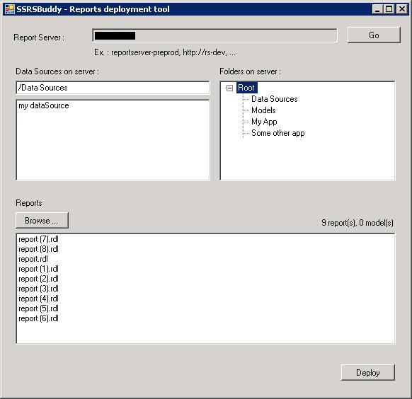

# SSRS-Buddy
SSRSBuddy enables deployment of multiple reports and report models onto a SSRS2005 instance, using shared datasources

If you use to swear at SQLServer Management Studio and its inability to upload more that 1 report at a time, SSRSBuddy is for you.

It uses SSRS Webservices to upload a bunch of report definition files (.RDL) and report models (.SMDL), and set the datasource of the uploaded items to one of the shared datasource on the server.

 It is available with a GUI. For A command-line version, please see [SSRS-Deployer](https://github.com/LetterBllc/SSRS-Deployer).

## Usage Steps
1. Enter the server name. Click "Go". *By default the tool searches the shared data sources in the /Data Sources folder. This can be changed, the list of data sources will be refreshed by clicking the Go button again.*
2. Select a data source.
3. Select the folder where you want to upload the reports.
4. Click "Browse" to select files to upload. All the files added to the list will be imported into SSRS.
5. Click "Deploy" to start the deployment process.

## Credits
This project is forked from [SSRS Buddy](http://ssrsbuddy.codeplex.com/) on CodePlex and includes new patches and updates developed by [Letter B](http://letterbllc.com/).